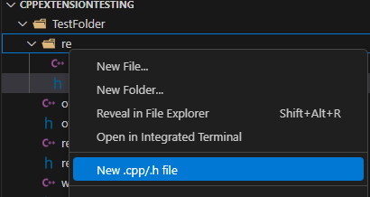
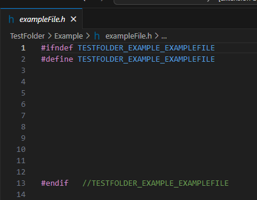
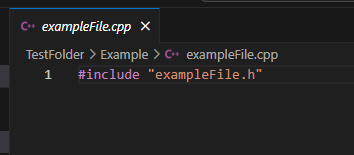

# cpph-fileadder README

## Features

Adds context menu items to:
-add c/h file
-add cpp/h file
-add cpp/hpp file

When right clicking a folder in folder explorer, adds an option to add a (c/h), (cpp/h), or (cpp/hpp) file at the same time. The c(pp) file automatically has the h(pp) file as an #include

Extension settings currently allow for:
- Automatically create include guards
- Open Cpp file after creation
- Open H file after creation

1) Right Clicking On Folder And Selecting "New .cpp/.h file"

2) Entering File Name

3) Example Name Entered, Hit "Enter"

4) Example H File Created

5) Example CPP File Created

### 1.0.0

Initial release.

